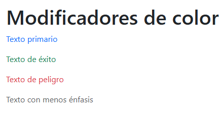

# 8. Modificadores de color y estilos temáticos

En esta parte vamos a ver dos cosas muy importantes de Bootstrap:

1. **Colores:** cómo aplicar fácilmente colores a texto, fondos, bordes y componentes usando las utilidades que ya vienen con Bootstrap.  
2. **Estilos temáticos:** cómo funcionan los modos light/dark y cómo se puede cambiar los colores base de todo el proyecto usando variables de Bootstrap.

[](http://https://dev.to/ijash/customizing-bootstrap-5-color-theme-in-create-react-app-48d7 "imagen10")

---

## A) Colores

### 1. ¿Qué son los colores en Bootstrap?
Bootstrap trae una paleta de colores lista para usar en clases. Los principales:

- `primary` (azul por defecto)
- `secondary` (gris)
- `success` (verde)
- `danger` (rojo)
- `warning` (amarillo)
- `info` (celeste)
- `light` (fondo claro)
- `dark` (fondo oscuro)

Con esto puedo dar estilo rápidamente sin escribir CSS.

---

### 2. Colores en texto
Para cambiar el color del texto uso `.text-*`. Ejemplo:

```html
<p class="text-primary">Texto primario</p>
<p class="text-success">Texto de éxito</p>
<p class="text-danger">Texto de peligro</p>
<p class="text-muted">Texto con menos énfasis</p>
```


### Aquí cada línea toma el color automáticamente según la clase usada.
### .text-muted es especial, porque sirve para darle menos importancia visual al texto.
---

### 3. Colores de fondo

Bootstrap también permite cambiar el color de los fondos de forma muy rápida con las clases `.bg-*`.  
Estas se combinan con clases de texto (`.text-*`) para asegurar que el contraste sea correcto.

### Ejemplo:

```html
<div class="bg-primary text-white p-2 rounded">Fondo azul con texto blanco</div>
<div class="bg-warning text-dark p-2 rounded">Fondo amarillo con texto oscuro</div>
<div class="text-bg-success p-2 rounded">Fondo verde con contraste automático</div>
```
