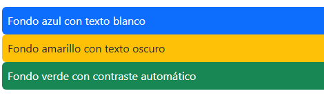
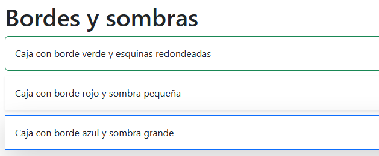
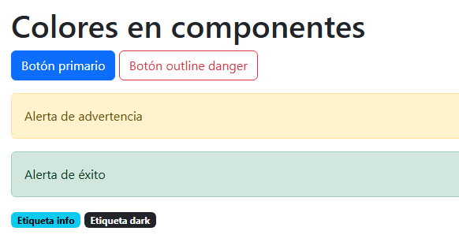
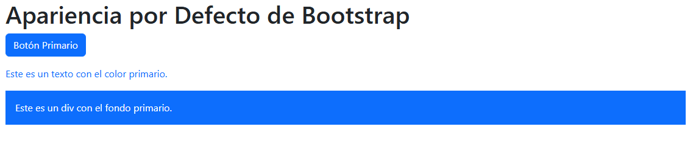
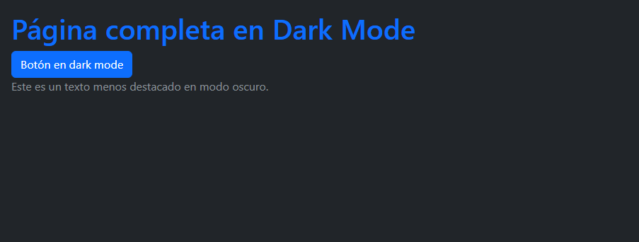
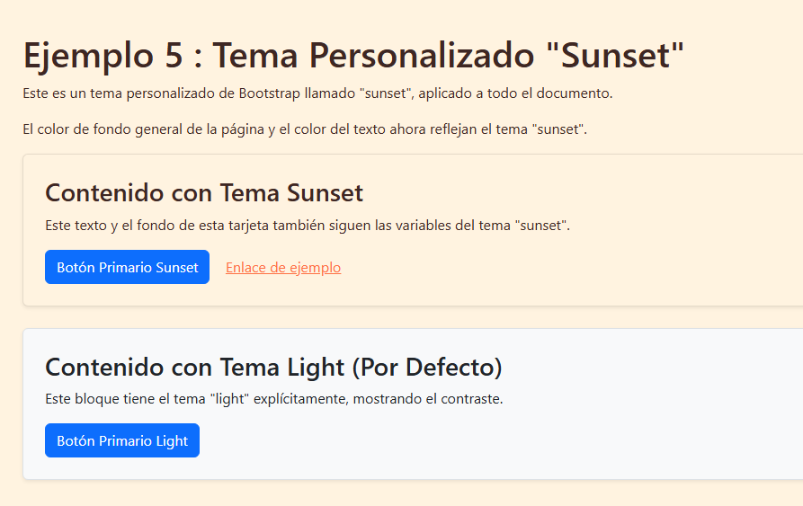
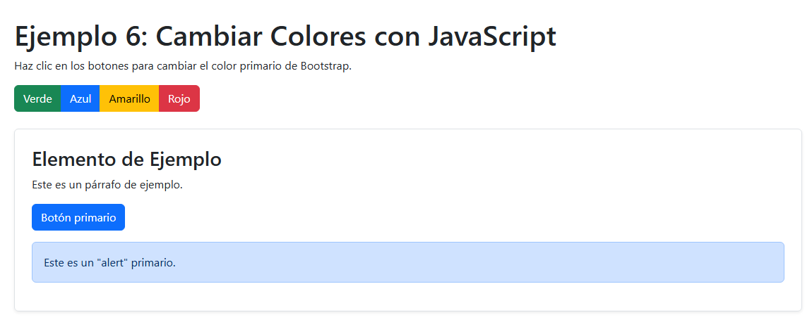

# 8. Modificadores de color y estilos temáticos

En esta parte vamos a ver dos cosas muy importantes de Bootstrap:

1. **Colores:** cómo aplicar fácilmente colores a texto, fondos, bordes y componentes usando las utilidades que ya vienen con Bootstrap.  
2. **Estilos temáticos:** cómo funcionan los modos light/dark y cómo se puede cambiar los colores base de todo el proyecto usando variables de Bootstrap.

[](http://https://dev.to/ijash/customizing-bootstrap-5-color-theme-in-create-react-app-48d7 "imagen10")

---

## A) Colores

### 1. ¿Qué son los colores en Bootstrap?
Bootstrap trae una paleta de colores lista para usar en clases. Los principales:

- `primary` (azul por defecto)
- `secondary` (gris)
- `success` (verde)
- `danger` (rojo)
- `warning` (amarillo)
- `info` (celeste)
- `light` (fondo claro)
- `dark` (fondo oscuro)

Con esto puedo dar estilo rápidamente sin escribir CSS.

---

### 2. Colores en texto
Para cambiar el color del texto uso `.text-*`. Ejemplo:

```html
<p class="text-primary">Texto primario</p>
<p class="text-success">Texto de éxito</p>
<p class="text-danger">Texto de peligro</p>
<p class="text-muted">Texto con menos énfasis</p>
```


##### Aquí cada línea toma el color automáticamente según la clase usada.
##### .text-muted es especial, porque sirve para darle menos importancia visual al texto.

---

### 3. Colores de fondo

Bootstrap también permite cambiar el color de los fondos de forma muy rápida con las clases `.bg-*`.  
Estas se combinan con clases de texto (`.text-*`) para asegurar que el contraste sea correcto.

### Ejemplo:

```html
<div class="bg-primary text-white p-2 rounded">Fondo azul con texto blanco</div>
<div class="bg-warning text-dark p-2 rounded">Fondo amarillo con texto oscuro</div>
<div class="text-bg-success p-2 rounded">Fondo verde con contraste automático</div>
```


##### Notamos que .text-bg-* ajusta automáticamente el color del texto para que siempre sea legible.

---

## 4. Bordes y sombras

Bootstrap incluye utilidades para bordes y sombras que facilitan la personalización visual de tus elementos:

```html
<div class="border border-success p-3 mb-2 rounded">
  Caja con borde verde y esquinas redondeadas
</div>
<div class="border border-danger p-3 mb-2 shadow-sm">
  Caja con borde rojo y sombra pequeña
</div>
<div class="border border-primary p-3 shadow-lg">
  Caja con borde azul y sombra grande
</div>
```


- ✅ `.border-*` aplica color al borde.
- ✅ `.shadow-*` (`sm`, normal, `lg`) agrega distintos niveles de sombra.

---

## 5. Colores en componentes

Bootstrap permite aplicar colores directamente a componentes como botones, alertas y badges:

```html
<button class="btn btn-primary">Botón primario</button>
<button class="btn btn-outline-danger">Botón outline danger</button>

<div class="alert alert-warning mt-3">Alerta de advertencia</div>
<div class="alert alert-success">Alerta de éxito</div>

<span class="badge text-bg-info">Etiqueta info</span>
<span class="badge text-bg-dark">Etiqueta dark</span>
```


👉 Esto permite construir interfaces rápidas con un estilo consistente.

---

## B) Estilos temáticos

### 1. ¿Qué es un estilo temático?

Bootstrap usa variables CSS personalizadas (`--bs-*`) para manejar los colores principales del framework.
Estas variables controlan el color base de botones, fondos, textos y componentes.

👉 Si cambio una sola variable, ¡todo el tema se actualiza!

---

### 2. Variables más comunes

Algunas de las más usadas son:

- `--bs-primary`: color principal
- `--bs-secondary`: color secundario
- `--bs-body-bg`: color de fondo del body
- `--bs-body-color`: color de texto del body
- `--bs-border-color`: color de los bordes

---

### 3. Personalizar variables en CSS

Puedes sobrescribir las variables en tu archivo CSS o dentro de un `<style>`:

```html
<style>
  :root {
    --bs-primary: #e91e63;  /* rosa */
    --bs-body-bg: #f9f9f9;  /* amarillo */
    --bs-body-color: #212121; /* texto oscuro */
  }
</style>
```



👉 A partir de aquí, cualquier elemento con `btn-primary`, `text-primary` o `bg-primary` se pintará con el nuevo color.

---

### 4. Modo Light y Dark

Bootstrap permite aplicar un tema claro u oscuro usando `data-bs-theme`.

**Ejemplo global:**
```html
<html data-bs-theme="dark">
  <body class="p-3">
    <button class="btn btn-primary">Botón en dark mode</button>
  </body>
</html>
```


**Ejemplo por secciones:**
```html
<div data-bs-theme="light" class="p-3">
  Sección en modo claro
</div>

<div data-bs-theme="dark" class="p-3 mt-2">
  Sección en modo oscuro
</div>
```


👉 Con estos dos ejemplos puedes ver la diferencia entre aplicar el tema a toda la página o solo a secciones específicas.

---

### 5. Crear un tema propio

Puedes definir un tema especial con `data-bs-theme` y variables personalizadas:

```html
<style>
  [data-bs-theme="sunset"] {
    --bs-primary: #ff7043;  /* naranja atardecer */
    --bs-body-bg: #fff3e0; /* fondo cálido */
    --bs-body-color: #3e2723; /* texto marrón oscuro */
  }
</style>

<div data-bs-theme="sunset" class="p-3">
  <button class="btn btn-primary">Botón con tema Sunset</button>
</div>
```

---

### 6. Cambiar colores dinámicamente con JavaScript

También puedes manipular las variables con JS:

```html
<script>
  const root = document.documentElement;

  function cambiarPrimario(color) {
    root.style.setProperty('--bs-primary', color);
  }

  // Ejemplo: cambiarPrimario('#4caf50'); -> lo vuelve verde
</script>
```

👉 Esto es útil si quieres que el usuario pueda elegir el color principal desde un “selector de color”.

---

# 9. Diseño responsivo avanzado con media queries

En esta sección se explica cómo funciona el diseño responsivo en **Bootstrap** y cómo aprovechar las **media queries** para adaptar el sitio a diferentes tamaños de pantalla.

La idea es entender primero los **breakpoints de Bootstrap**, luego ver ejemplos de uso con utilidades, y finalmente aprender cómo crear **media queries personalizadas** para casos avanzados.

---

## A) Introducción al diseño responsivo

El **diseño responsivo** significa que una página web se ve bien en **móviles, tablets y computadoras**, ajustándose automáticamente.

Bootstrap tiene un sistema de **grid** y clases utilitarias basadas en **media queries** que facilitan este trabajo.

---

## B) Breakpoints en Bootstrap

Bootstrap define puntos de corte (*breakpoints*) que corresponden a los tamaños más comunes de pantallas:

| Tamaño              | Prefijo      | Valor mínimo |
|---------------------|--------------|--------------|
| Extra pequeño       | (sin prefijo)| <576px       |
| Pequeño             | `sm`         | ≥576px       |
| Mediano             | `md`         | ≥768px       |
| Grande              | `lg`         | ≥992px       |
| Extra grande        | `xl`         | ≥1200px      |
| Extra extra grande  | `xxl`        | ≥1400px      |

👉 Con estos breakpoints, Bootstrap cambia el diseño según el ancho de la pantalla.

---

## C) Ejemplo básico de grid responsivo

Usamos los breakpoints para organizar el contenido:

```html
<div class="container text-center">
  <div class="row">
    <div class="col-12 col-md-6 col-lg-4 bg-primary text-white p-3">Columna 1</div>
    <div class="col-12 col-md-6 col-lg-4 bg-success text-white p-3">Columna 2</div>
    <div class="col-12 col-md-12 col-lg-4 bg-warning text-dark p-3">Columna 3</div>
  </div>
</div>
```

**Explicación:**

- En pantallas pequeñas (`col-12`): cada columna ocupa todo el ancho (una debajo de otra).
- En pantallas medianas (`col-md-6`): aparecen dos columnas por fila.
- En pantallas grandes (`col-lg-4`): aparecen tres columnas en la misma fila.

✅ Esto demuestra cómo el layout cambia automáticamente con media queries.

---

## D) Clases utilitarias responsivas

Bootstrap tiene muchas utilidades que funcionan con los prefijos de breakpoint.

### 1. Mostrar/ocultar elementos

```html
<p class="d-none d-md-block">Este texto solo aparece en pantallas medianas en adelante.</p>
<p class="d-block d-md-none">Este texto solo aparece en pantallas pequeñas.</p>
```

👉 Esto se usa mucho para mostrar distintos menús en móvil y escritorio.

### 2. Alineación de texto

```html
<p class="text-center text-md-start">
  Este texto está centrado en móviles pero alineado a la izquierda en pantallas medianas y grandes.
</p>
```

### 3. Espaciado (padding y margin)

```html
<div class="p-2 p-md-5 bg-light border">
  Caja con poco padding en móvil, pero con mucho padding en pantallas medianas en adelante.
</div>
```

---

## E) Media queries personalizadas

A veces necesitamos escribir nuestras propias reglas en CSS para casos específicos:

```html
<style>
  /* Para pantallas menores a 768px */
  @media (max-width: 767px) {
    body {
      background-color: #f8bbd0; /* rosado */
    }
  }

  /* Para pantallas grandes (≥992px) */
  @media (min-width: 992px) {
    body {
      background-color: #bbdefb; /* celeste */
    }
  }
</style>
```

👉 Con esto, el fondo de la página cambia de color según el tamaño de pantalla.
