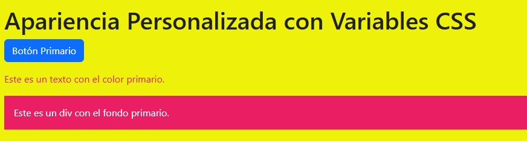

# 8. Modificadores de color y estilos temáticos

En esta parte vamos a ver dos cosas muy importantes de Bootstrap:

1. **Colores:** cómo aplicar fácilmente colores a texto, fondos, bordes y componentes usando las utilidades que ya vienen con Bootstrap.  
2. **Estilos temáticos:** cómo funcionan los modos light/dark y cómo se puede cambiar los colores base de todo el proyecto usando variables de Bootstrap.

[](http://https://dev.to/ijash/customizing-bootstrap-5-color-theme-in-create-react-app-48d7 "imagen10")

---

## A) Colores

### 1. ¿Qué son los colores en Bootstrap?
Bootstrap trae una paleta de colores lista para usar en clases. Los principales:

- `primary` (azul por defecto)
- `secondary` (gris)
- `success` (verde)
- `danger` (rojo)
- `warning` (amarillo)
- `info` (celeste)
- `light` (fondo claro)
- `dark` (fondo oscuro)

Con esto puedo dar estilo rápidamente sin escribir CSS.

---

### 2. Colores en texto
Para cambiar el color del texto uso `.text-*`. Ejemplo:

```html
<p class="text-primary">Texto primario</p>
<p class="text-success">Texto de éxito</p>
<p class="text-danger">Texto de peligro</p>
<p class="text-muted">Texto con menos énfasis</p>
```


##### Aquí cada línea toma el color automáticamente según la clase usada.
##### .text-muted es especial, porque sirve para darle menos importancia visual al texto.

---

### 3. Colores de fondo

Bootstrap también permite cambiar el color de los fondos de forma muy rápida con las clases `.bg-*`.  
Estas se combinan con clases de texto (`.text-*`) para asegurar que el contraste sea correcto.

### Ejemplo:

```html
<div class="bg-primary text-white p-2 rounded">Fondo azul con texto blanco</div>
<div class="bg-warning text-dark p-2 rounded">Fondo amarillo con texto oscuro</div>
<div class="text-bg-success p-2 rounded">Fondo verde con contraste automático</div>
```


##### Notamos que .text-bg-* ajusta automáticamente el color del texto para que siempre sea legible.

---

## 4. Bordes y sombras

Bootstrap incluye utilidades para bordes y sombras que facilitan la personalización visual de tus elementos:

```html
<div class="border border-success p-3 mb-2 rounded">
  Caja con borde verde y esquinas redondeadas
</div>
<div class="border border-danger p-3 mb-2 shadow-sm">
  Caja con borde rojo y sombra pequeña
</div>
<div class="border border-primary p-3 shadow-lg">
  Caja con borde azul y sombra grande
</div>
```


- ✅ `.border-*` aplica color al borde.
- ✅ `.shadow-*` (`sm`, normal, `lg`) agrega distintos niveles de sombra.

---

## 5. Colores en componentes

Bootstrap permite aplicar colores directamente a componentes como botones, alertas y badges:

```html
<button class="btn btn-primary">Botón primario</button>
<button class="btn btn-outline-danger">Botón outline danger</button>

<div class="alert alert-warning mt-3">Alerta de advertencia</div>
<div class="alert alert-success">Alerta de éxito</div>

<span class="badge text-bg-info">Etiqueta info</span>
<span class="badge text-bg-dark">Etiqueta dark</span>
```


👉 Esto permite construir interfaces rápidas con un estilo consistente.

---

## B) Estilos temáticos

### 1. ¿Qué es un estilo temático?

Bootstrap usa variables CSS personalizadas (`--bs-*`) para manejar los colores principales del framework.
Estas variables controlan el color base de botones, fondos, textos y componentes.

👉 Si cambio una sola variable, ¡todo el tema se actualiza!

---

### 2. Variables más comunes

Algunas de las más usadas son:

- `--bs-primary`: color principal
- `--bs-secondary`: color secundario
- `--bs-body-bg`: color de fondo del body
- `--bs-body-color`: color de texto del body
- `--bs-border-color`: color de los bordes

---

### 3. Personalizar variables en CSS

Puedes sobrescribir las variables en tu archivo CSS o dentro de un `<style>`:

```html
<style>
  :root {
    --bs-primary: #e91e63;  /* rosa */
    --bs-body-bg: #f9f9f9;  /* amarillo */
    --bs-body-color: #212121; /* texto oscuro */
  }
</style>
```




👉 A partir de aquí, cualquier elemento con `btn-primary`, `text-primary` o `bg-primary` se pintará con el nuevo color.

---

### 4. Modo Light y Dark

Bootstrap permite aplicar un tema claro u oscuro usando `data-bs-theme`.

**Ejemplo global:**
```html
<html data-bs-theme="dark">
  <body class="p-3">
    <button class="btn btn-primary">Botón en dark mode</button>
  </body>
</html>
```

**Ejemplo por secciones:**
```html
<div data-bs-theme="light" class="p-3">
  Sección en modo claro
</div>

<div data-bs-theme="dark" class="p-3 mt-2">
  Sección en modo oscuro
</div>
```

👉 Esto da flexibilidad: puedes tener un header oscuro y un body claro.

---

### 5. Crear un tema propio

Puedes definir un tema especial con `data-bs-theme` y variables personalizadas:

```html
<style>
  [data-bs-theme="sunset"] {
    --bs-primary: #ff7043;  /* naranja atardecer */
    --bs-body-bg: #fff3e0; /* fondo cálido */
    --bs-body-color: #3e2723; /* texto marrón oscuro */
  }
</style>

<div data-bs-theme="sunset" class="p-3">
  <button class="btn btn-primary">Botón con tema Sunset</button>
</div>
```

---

### 6. Cambiar colores dinámicamente con JavaScript

También puedes manipular las variables con JS:

```html
<script>
  const root = document.documentElement;

  function cambiarPrimario(color) {
    root.style.setProperty('--bs-primary', color);
  }

  // Ejemplo: cambiarPrimario('#4caf50'); -> lo vuelve verde
</script>
```

👉 Esto es útil si quieres que el usuario pueda elegir el color principal desde un “selector de color”.
